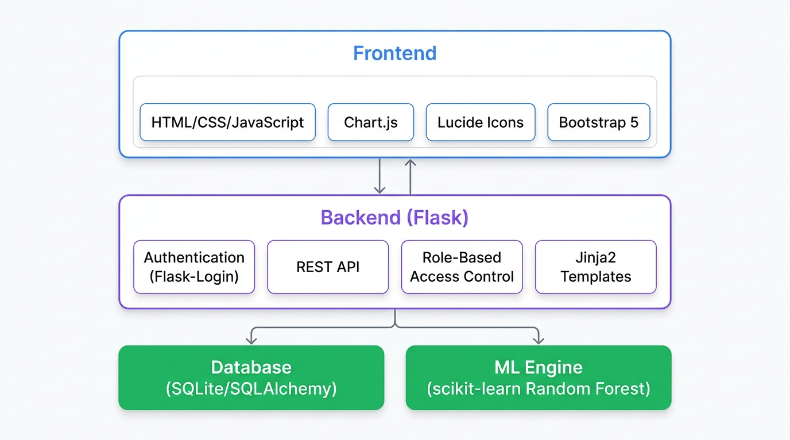
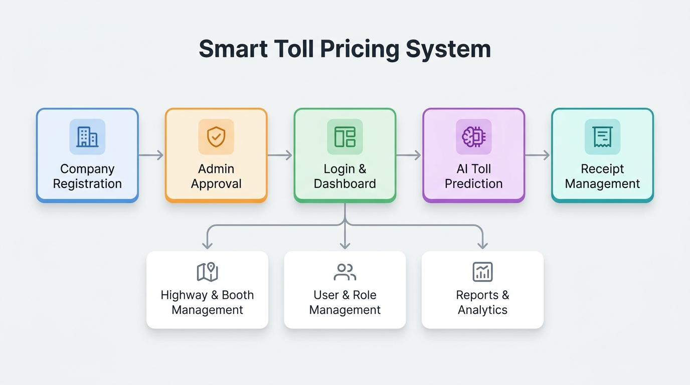
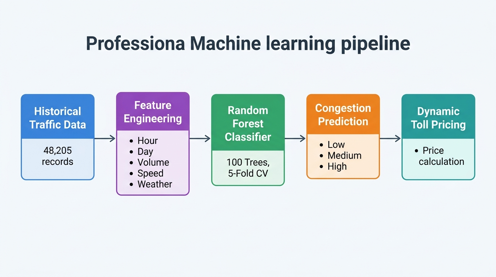
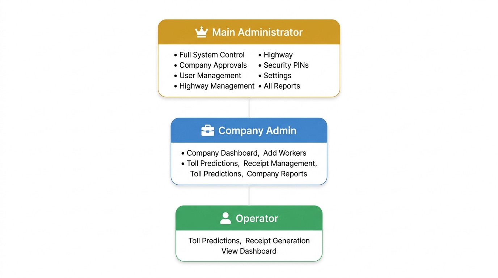
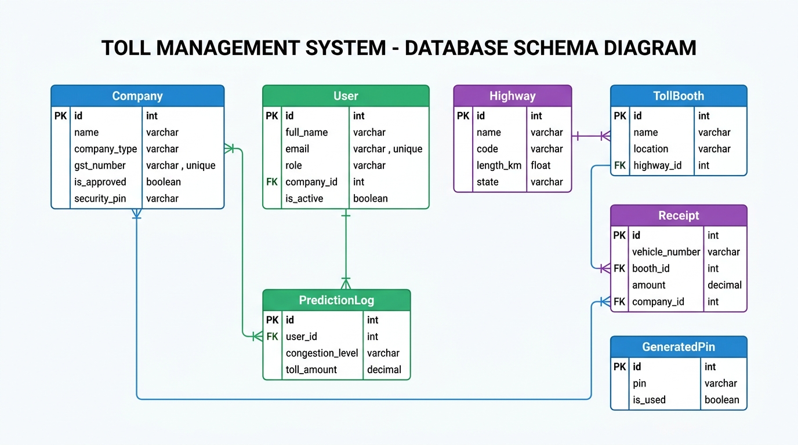

<p align="center">
  
</p>

<h1 align="center">🛣️ Smart Toll Pricing System</h1>

<p align="center">
  <strong>AI-Powered Dynamic Toll Management Platform</strong>
</p>

<p align="center">
  
  
  
  
  
  
  
</p>

<p align="center">
  An enterprise-grade, AI-powered toll pricing platform that leverages <strong>Random Forest classification</strong> to predict real-time traffic congestion and dynamically adjust toll prices. Built with <strong>Flask</strong>, <strong>scikit-learn</strong>, and a modern <strong>glassmorphism UI</strong>.
</p>

---

## 📑 Table of Contents

- [Overview](#-overview)
- [Key Features](#-key-features)
- [System Architecture](#-system-architecture)
- [Application Workflow](#-application-workflow)
- [ML Pipeline](#-ml-pipeline)
- [Role-Based Access Control](#-role-based-access-control)
- [Database Schema](#-database-schema)
- [Project Structure](#-project-structure)
- [Prerequisites](#-prerequisites)
- [Installation & Setup](#-installation--setup)
- [Default Credentials](#-default-credentials)
- [API Reference](#-api-reference)
- [Technology Stack](#-technology-stack)
- [Research Notebooks](#-research-notebooks)
- [Contributing](#-contributing)
- [License](#-license)
- [Author](#-author)

---

## 🔍 Overview

India's national highway network spans over **151,000 km**, with toll plazas processing millions of transactions daily. Traditional flat-rate toll pricing fails to account for real-time traffic conditions, leading to:

- ❌ Traffic congestion during peak hours
- ❌ Revenue leakage during off-peak periods
- ❌ Inequitable pricing for commuters
- ❌ Inefficient highway utilization

The **Smart Toll Pricing System** addresses these challenges by using **machine learning** to predict congestion levels and **dynamically adjust toll prices** — increasing prices during high-traffic periods to manage demand and reducing prices during low-traffic periods to encourage road usage.

### 📊 Model Performance

| Metric | Score |
|--------|-------|
| **Accuracy** | 98.37% |
| **Precision** | 98.38% |
| **Recall** | 98.37% |
| **F1 Score** | 98.37% |
| **Cross-Validation Mean** | 98.41% |

> Trained on **48,204 real traffic records** from the Metro Interstate Traffic Volume dataset (Kaggle).

---

## ✨ Key Features

### 🤖 AI & Machine Learning
- **Real-time congestion prediction** using a 100-tree Random Forest Classifier
- **Dynamic toll pricing engine** with configurable base rates and demand multipliers
- **16-feature engineering pipeline** (rush intensity, time-of-day, weather encoding, etc.)
- **5-fold cross-validated model** with 98.4% accuracy

### 🏗️ Infrastructure Management
- **Highway CRUD operations** — add, edit, delete national highways
- **Toll booth management** — create booths with GPS coordinates, status tracking (Online / Offline / Maintenance)
- **Interactive map view** — visualize toll booth network across India

### 👥 User & Access Management
- **Three-tier RBAC** — Main Administrator, Company Admin, Operator
- **Company registration workflow** — register with GST details and admin-generated security PIN
- **Company approval gateway** — Main Admin must approve before company users can access the platform
- **User activation/deactivation** — toggle access without deleting accounts

### 💰 Receipt & Revenue Management
- **Digital toll receipts** — generate receipts with vehicle details, payment mode (FASTag / Cash / Card)
- **Searchable receipt history** — paginated listing with keyword search
- **Receipt download** — export individual receipts as `.txt` files
- **Revenue KPI dashboard** — real-time revenue tracking, hourly breakdown, top-performing booths

### 📈 Analytics & Reporting
- **Business KPI dashboard** — vehicles processed, revenue, active booths, congestion distribution
- **Prediction audit logs** — full history of all ML predictions with timestamps
- **Export capabilities** — download reports as CSV or Excel (`.xlsx`)
- **Feature importance visualization** — understand what drives congestion predictions

### 🔐 Security
- **Password hashing** — Werkzeug-powered secure password storage
- **Session authentication** — Flask-Login with "Remember Me" support
- **Security PIN system** — one-time-use 8-digit PINs for company registration
- **Role-based route protection** — custom `@roles_required()` decorator

---

## 🏛️ System Architecture

<p align="center">
  
</p>

The application follows a **three-tier architecture**:

```
┌─────────────────────────────────────────────────────────────────┐
│                      PRESENTATION LAYER                         │
│  HTML5 / CSS3 / JavaScript / Bootstrap 5.3 / Chart.js 4.4      │
│  Glassmorphism UI • Lucide Icons • Google Fonts (Inter)         │
└───────────────────────────┬─────────────────────────────────────┘
                            │
┌───────────────────────────▼─────────────────────────────────────┐
│                      APPLICATION LAYER                          │
│  Flask 3.x • Jinja2 Templates • Flask-Login • REST API          │
│  Role-Based Access Control • Dynamic Pricing Engine             │
└──────────┬──────────────────────────────────┬───────────────────┘
           │                                  │
┌──────────▼──────────┐          ┌────────────▼────────────────┐
│    DATA LAYER       │          │     ML ENGINE                │
│  SQLite + SQLAlchemy│          │  scikit-learn Random Forest  │
│  8 Database Models  │          │  joblib Model Serialization  │
│  Auth Database      │          │  pandas Feature Engineering  │
└─────────────────────┘          └─────────────────────────────┘
```

---

## 🔄 Application Workflow

<p align="center">
  
</p>

### User Journey

```
Company Registration ──→ Admin Approval ──→ Login ──→ Dashboard
         │                                              │
         └─ Security PIN required                       ├── AI Toll Prediction
            (generated by Main Admin)                   ├── Receipt Generation
                                                        ├── Highway & Booth Management
                                                        ├── User & Role Management
                                                        └── Reports & Analytics
```

1. **Main Admin** generates a security PIN from the Settings panel
2. **Company** registers with business details + the security PIN
3. **Main Admin** reviews and approves the company registration
4. **Company Admin** logs in and accesses their dashboard
5. **Company Admin** creates **Operator** accounts for toll booth workers
6. **Operators** use the AI simulator and generate toll receipts

---

## 🧠 ML Pipeline

<p align="center">
  
</p>

### Pipeline Stages

| Stage | Description |
|-------|-------------|
| **1. Data Ingestion** | Load 48,204 records from the Metro Interstate Traffic Volume dataset |
| **2. Preprocessing** | Handle missing values, encode categorical features, normalize temperatures |
| **3. Feature Engineering** | Extract 16 features: `hour`, `day_of_week`, `rush_intensity`, `time_of_day`, `season`, `day_type`, `vol_noisy`, `speed_noisy`, `travel_time`, `temp_celsius`, `rain_1h`, `snow_1h`, `clouds_all`, `weather_encoded`, `bad_weather` |
| **4. Model Training** | Random Forest Classifier with 100 trees, 5-fold cross-validation |
| **5. Prediction** | Classify congestion as **Low** (0), **Medium** (1), or **High** (2) |
| **6. Pricing** | Calculate dynamic toll based on congestion level + demand multiplier + speed penalty |

### Top Feature Importances

| Feature | Importance |
|---------|------------|
| `travel_time` | **47.15%** |
| `vol_noisy` (Traffic Volume) | **19.17%** |
| `speed_noisy` (Average Speed) | **15.03%** |
| `hour` | **6.90%** |
| `time_of_day` | **6.66%** |

### Dynamic Pricing Formula

```
Base Toll = { Low: ₹50, Medium: ₹80, High: ₹120 }  (configurable)

Demand Multiplier:
  × 1.5  if traffic_volume > 5,000
  × 1.2  if traffic_volume > 3,500
  × 1.0  otherwise

Speed Penalty:
  + 0.3  if avg_speed < 20 km/h

Final Toll = Base × (Demand Multiplier + Speed Penalty)

Price Range: ₹50 (low traffic, off-peak) → ₹216 (high traffic, surge)
```

---

## 🔐 Role-Based Access Control

<p align="center">
  
</p>

### Permission Matrix

| Feature | Main Admin | Company Admin | Operator |
|---------|:----------:|:-------------:|:--------:|
| System Dashboard | ✅ | ✅ | ✅ |
| AI Toll Prediction | ✅ | ✅ | ✅ |
| Generate Receipts | ❌ | ❌ | ✅ |
| View Receipts | ✅ | ✅ | ✅ |
| Company Profile | ✅ | ✅ | ❌ |
| Create Workers | ❌ | ✅ | ❌ |
| Manage Highways | ✅ | ❌ | ❌ |
| Manage Toll Booths | ✅ | ✅ | ❌ |
| Approve Companies | ✅ | ❌ | ❌ |
| Manage All Users | ✅ | ❌ | ❌ |
| System Settings | ✅ | ✅ | ❌ |
| Generate Security PINs | ✅ | ❌ | ❌ |
| Export Reports | ✅ | ✅ | ❌ |
| Delete Companies | ✅ | ❌ | ❌ |

---

## 🗄️ Database Schema

<p align="center">
  
</p>

The application uses **SQLite** with **SQLAlchemy ORM** and manages **8 database models**:

| Model | Description | Key Fields |
|-------|-------------|------------|
| **Company** | Toll operating companies | `name`, `gst_number`, `is_approved`, `security_pin` |
| **User** | System users (3 roles) | `email`, `role`, `company_id`, `is_active` |
| **Highway** | National highway records | `name`, `code`, `length_km`, `state` |
| **TollBooth** | Individual toll plazas | `name`, `location`, `latitude`, `longitude`, `status` |
| **PredictionLog** | ML prediction audit trail | `congestion_level`, `toll_price`, `confidence` |
| **Receipt** | Toll transaction receipts | `vehicle_number`, `vehicle_type`, `payment_mode`, `amount` |
| **GeneratedPin** | Registration security PINs | `pin`, `is_used` |
| **SystemSetting** | Configurable parameters | `key`, `value` (e.g., base toll prices) |

### Entity Relationships

```
Company  1──────M  User
Company  1──────M  Receipt
Highway  1──────M  TollBooth
TollBooth 1─────M  Receipt
User     1──────M  PredictionLog
```

---

## 📂 Project Structure

```
toll-price-managemnet-master/
│
├── 📄 app.py                          # Main Flask application (1,363 lines)
├── 📄 README.md                       # Project documentation
│
├── 📁 data/                           # Datasets
│   ├── Metro_Interstate_Traffic_Volume.csv   # Raw Kaggle dataset (2.9 MB)
│   ├── processed_traffic.csv                 # Processed data (4.8 MB)
│   ├── final_features.csv                    # Engineered features (2.8 MB)
│   └── eda_summary.txt                       # EDA summary statistics
│
├── 📁 models/                         # Trained ML models
│   ├── rf_model.pkl                   # Random Forest model (13.3 MB)
│   └── metrics.json                   # Model performance metrics
│
├── 📁 templates/                      # Jinja2 HTML templates
│   ├── index.html                     # Main SPA dashboard (5,642 lines)
│   ├── login.html                     # Login page
│   ├── register.html                  # Company registration (multi-step)
│   └── forgot_password.html           # Password reset (2-step)
│
├── 📁 static/                         # Static assets
│   └── charts/                        # Pre-generated EDA charts
│       ├── confusion_matrix.png
│       ├── congestion_dist.png
│       ├── daily_volume.png
│       ├── feature_importance.png
│       ├── heatmap.png
│       ├── heatmap_hour_day.png
│       ├── hourly.png
│       ├── hourly_volume.png
│       ├── volume_vs_speed.png
│       └── weather_effect.png
│
├── 📁 instance/                       # Runtime database
│   └── auth.db                        # SQLite database
│
├── 📁 docs/                           # Documentation assets
│   └── images/                        # README images
│       ├── banner.jpg
│       ├── architecture.jpg
│       ├── workflow.jpg
│       ├── rbac.jpg
│       ├── ml_pipeline.jpg
│       └── database_schema.jpg
│
├── 📓 Data_Analysis.ipynb             # Phase 1: EDA & visualization
├── 📓 Model_Training.ipynb            # Phase 2: Model training & evaluation
├── 📓 Pricing_Engine.ipynb            # Phase 3: Dynamic pricing logic
└── 📓 Web_Application.ipynb           # Phase 4: System integration
```

---

## ⚙️ Prerequisites

Before running this project, ensure you have the following installed:

### System Requirements

| Requirement | Minimum Version | Purpose |
|-------------|----------------|---------|
| **Python** | 3.10+ | Runtime environment |
| **pip** | 21.0+ | Package manager |
| **Git** | 2.30+ | Version control |
| **Web Browser** | Chrome/Firefox/Edge (latest) | Frontend rendering |

### Hardware Recommendations

| Component | Minimum | Recommended |
|-----------|---------|-------------|
| **RAM** | 4 GB | 8 GB |
| **Storage** | 500 MB | 1 GB |
| **CPU** | 2 cores | 4 cores |

### Python Packages

| Package | Version | Purpose |
|---------|---------|---------|
| `flask` | ≥ 3.0 | Web framework |
| `flask-sqlalchemy` | ≥ 3.1 | ORM & database |
| `flask-login` | ≥ 0.6 | Authentication |
| `werkzeug` | ≥ 3.0 | Password hashing |
| `scikit-learn` | ≥ 1.3 | Machine learning |
| `pandas` | ≥ 2.0 | Data manipulation |
| `numpy` | ≥ 1.24 | Numerical computing |
| `joblib` | ≥ 1.3 | Model serialization |
| `matplotlib` | ≥ 3.8 | Visualization (notebooks) |
| `openpyxl` | ≥ 3.1 | Excel export |

---

## 🚀 Installation & Setup

### 1. Clone the Repository

```bash
git clone https://github.com/Nitinrajgor07/toll-price-managemnet.git
cd toll-price-managemnet
```

### 2. Create Virtual Environment

```bash
# Windows
python -m venv venv
venv\Scripts\activate

# macOS / Linux
python3 -m venv venv
source venv/bin/activate
```

### 3. Install Dependencies

```bash
pip install flask flask-sqlalchemy flask-login werkzeug scikit-learn pandas numpy joblib matplotlib openpyxl
```

### 4. Run the Application

```bash
python app.py
```

### 5. Access the Platform

Open your browser and navigate to:

```
http://127.0.0.1:5000
```

> **Note:** On first launch, the application automatically:
> - Creates the SQLite database (`instance/auth.db`)
> - Seeds the default Main Administrator account
> - Seeds 11 Indian highways and 12 toll booths with real GPS coordinates
> - Configures default toll pricing (Low: ₹50, Medium: ₹80, High: ₹120)

---

## 🔑 Default Credentials

| Role | Email | Password |
|------|-------|----------|
| **Main Administrator** | `admin@nhai.gov.in` | `Admin@1234` |

> ⚠️ **Security Notice:** Change the default password immediately after first login in a production environment.

### First-Time Setup Workflow

1. Log in with the Main Admin credentials above
2. Navigate to **Settings** → **Security PINs** → Generate a PIN
3. Share the PIN with the company that needs to register
4. The company registers at `/register` using the PIN
5. Approve the company from **User Management** → **Pending Companies**
6. The company admin can now log in and create operator accounts

---

## 📡 API Reference

### Authentication

| Method | Endpoint | Description |
|--------|----------|-------------|
| `POST` | `/login` | Authenticate user |
| `GET` | `/logout` | End session |
| `POST` | `/register` | Register new company |
| `POST` | `/forgot-password` | Reset password |

### Prediction Engine

| Method | Endpoint | Auth | Description |
|--------|----------|------|-------------|
| `POST` | `/predict` | ✅ | Run ML congestion prediction |
| `GET` | `/dashboard-data` | ✅ | Get model metrics & visualizations |

### Business KPIs

| Method | Endpoint | Auth | Roles | Description |
|--------|----------|------|-------|-------------|
| `GET` | `/api/dashboard-kpis` | ✅ | All | Revenue, vehicles, booth stats |
| `GET` | `/api/alerts` | ✅ | All | Real-time congestion alerts |

### User & Company Management

| Method | Endpoint | Auth | Roles | Description |
|--------|----------|------|-------|-------------|
| `GET` | `/api/users` | ✅ | Admin | List users & companies |
| `POST` | `/api/users/approve-company/<id>` | ✅ | Main Admin | Approve company |
| `DELETE` | `/api/admin/companies/<id>` | ✅ | Main Admin | Delete company |
| `POST` | `/api/users/toggle-user/<id>` | ✅ | Admin | Toggle user status |
| `POST` | `/api/users/create-worker` | ✅ | Company Admin | Create operator |
| `GET` | `/api/company/profile` | ✅ | Admin | Company profile |

### Infrastructure

| Method | Endpoint | Auth | Roles | Description |
|--------|----------|------|-------|-------------|
| `GET` | `/api/highways` | ✅ | All | List highways |
| `POST` | `/api/highways` | ✅ | Main Admin | Create highway |
| `PUT` | `/api/highways/<id>` | ✅ | Main Admin | Update highway |
| `DELETE` | `/api/highways/<id>` | ✅ | Main Admin | Delete highway |
| `GET` | `/api/booths` | ✅ | All | List toll booths |
| `POST` | `/api/booths` | ✅ | Admin | Create toll booth |
| `PUT` | `/api/booths/<id>` | ✅ | Admin | Update toll booth |
| `DELETE` | `/api/booths/<id>` | ✅ | Admin | Delete toll booth |

### Receipts

| Method | Endpoint | Auth | Roles | Description |
|--------|----------|------|-------|-------------|
| `GET` | `/api/receipts` | ✅ | Worker, Admin | List receipts (paginated) |
| `POST` | `/api/receipts` | ✅ | Worker | Create receipt |
| `GET` | `/api/receipts/download/<id>` | ✅ | Worker, Admin | Download receipt (.txt) |

### Reports & Settings

| Method | Endpoint | Auth | Roles | Description |
|--------|----------|------|-------|-------------|
| `GET` | `/api/reports/prediction-log` | ✅ | Admin | Prediction audit logs |
| `GET` | `/api/reports/export/<format>` | ✅ | Admin | Export CSV/Excel |
| `GET/POST` | `/api/settings` | ✅ | Admin | System settings |
| `GET` | `/api/pins` | ✅ | Main Admin | List security PINs |
| `POST` | `/api/pins/generate` | ✅ | Main Admin | Generate PIN |
| `DELETE` | `/api/pins/<id>` | ✅ | Main Admin | Delete unused PIN |

---

## 🛠️ Technology Stack

<table>
  <tr>
    <th>Category</th>
    <th>Technology</th>
    <th>Version</th>
  </tr>
  <tr>
    <td><strong>Language</strong></td>
    <td>Python</td>
    <td>3.11+</td>
  </tr>
  <tr>
    <td><strong>Web Framework</strong></td>
    <td>Flask</td>
    <td>3.x</td>
  </tr>
  <tr>
    <td><strong>Database</strong></td>
    <td>SQLite via SQLAlchemy</td>
    <td>—</td>
  </tr>
  <tr>
    <td><strong>Authentication</strong></td>
    <td>Flask-Login + Werkzeug</td>
    <td>—</td>
  </tr>
  <tr>
    <td><strong>Machine Learning</strong></td>
    <td>scikit-learn (Random Forest)</td>
    <td>1.3+</td>
  </tr>
  <tr>
    <td><strong>Data Processing</strong></td>
    <td>pandas, numpy</td>
    <td>—</td>
  </tr>
  <tr>
    <td><strong>Model Serialization</strong></td>
    <td>joblib</td>
    <td>—</td>
  </tr>
  <tr>
    <td><strong>Frontend Framework</strong></td>
    <td>Bootstrap</td>
    <td>5.3.0</td>
  </tr>
  <tr>
    <td><strong>Charts</strong></td>
    <td>Chart.js</td>
    <td>4.4.0</td>
  </tr>
  <tr>
    <td><strong>Icons</strong></td>
    <td>Lucide Icons</td>
    <td>0.400.0</td>
  </tr>
  <tr>
    <td><strong>Typography</strong></td>
    <td>Google Fonts (Inter)</td>
    <td>—</td>
  </tr>
  <tr>
    <td><strong>UI Pattern</strong></td>
    <td>Glassmorphism</td>
    <td>—</td>
  </tr>
  <tr>
    <td><strong>Template Engine</strong></td>
    <td>Jinja2</td>
    <td>—</td>
  </tr>
  <tr>
    <td><strong>Data Visualization</strong></td>
    <td>matplotlib (notebooks)</td>
    <td>—</td>
  </tr>
  <tr>
    <td><strong>Export</strong></td>
    <td>CSV (pandas), Excel (openpyxl)</td>
    <td>—</td>
  </tr>
</table>

---

## 📓 Research Notebooks

The project development followed a **4-phase research methodology**, documented in Jupyter Notebooks:

| Phase | Notebook | Description |
|-------|----------|-------------|
| **Phase 1** | `Data_Analysis.ipynb` | Exploratory Data Analysis — data loading, cleaning, statistical analysis, 10 visualization charts (hourly volume, weather effects, heatmaps, etc.) |
| **Phase 2** | `Model_Training.ipynb` | Feature engineering, Random Forest training, hyperparameter tuning, 5-fold cross-validation, confusion matrix analysis |
| **Phase 3** | `Pricing_Engine.ipynb` | Dynamic pricing algorithm design, demand multiplier calibration, real-world test scenarios |
| **Phase 4** | `Web_Application.ipynb` | System integration verification, Flask application launch, end-to-end testing |

### Generated EDA Charts

The following charts are pre-generated and stored in `static/charts/`:

| Chart | Description |
|-------|-------------|
| `hourly_volume.png` | Traffic volume distribution by hour |
| `daily_volume.png` | Traffic patterns across days of the week |
| `weather_effect.png` | Impact of weather conditions on traffic |
| `volume_vs_speed.png` | Correlation between volume and speed |
| `heatmap_hour_day.png` | Hour × Day traffic heatmap |
| `congestion_dist.png` | Distribution of congestion levels |
| `feature_importance.png` | Random Forest feature importance ranking |
| `confusion_matrix.png` | Model prediction confusion matrix |
| `heatmap.png` | Feature correlation heatmap |
| `hourly.png` | Hourly traffic trends |

---

## 🤝 Contributing

Contributions are welcome! Please follow these steps:

1. **Fork** the repository
2. **Create** a feature branch (`git checkout -b feature/amazing-feature`)
3. **Commit** your changes (`git commit -m 'Add amazing feature'`)
4. **Push** to the branch (`git push origin feature/amazing-feature`)
5. **Open** a Pull Request

### Contribution Guidelines

- Follow PEP 8 for Python code style
- Add docstrings for new functions
- Update the README if adding new features
- Test your changes before submitting a PR

---

## 📄 License

This project is licensed under the **MIT License** — see the [LICENSE](LICENSE) file for details.

---

## 👤 Author

**Nitin Rajgor**

- 🎓 Jain (Deemed-to-be) University, Bengaluru
- 📧 GitHub: [@Nitinrajgor07](https://github.com/Nitinrajgor07)

### Academic Publication

> Published in **IRE Journals**, Volume 9, Issue 11, May 2026

---

<p align="center">
  <strong>⭐ Star this repository if you found it helpful!</strong>
</p>

<p align="center">
  Made with ❤️ in India 🇮🇳
</p>
